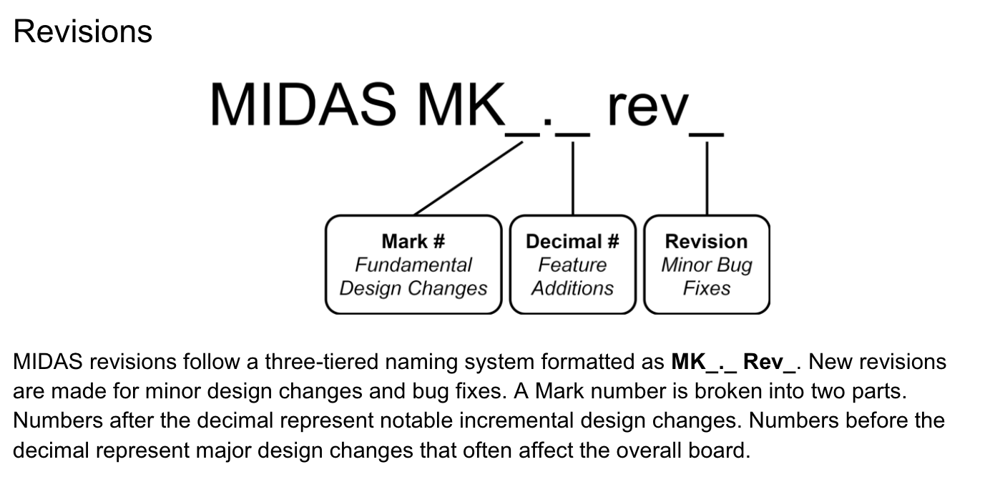

# What is this REPO?

This repo contains all the boards we believe to be stale. 

# How does ISS-PCB naming convention work??

That is a good question. Please see below.

This is defined as part of the [MIDAS 2023-2024 Report](https://uofi.box.com/s/ehres752iaeetvryr3me8g2p3k849buu)

# What makes a project Stale/Archived?

An ENTIRE BOARD will be archived under these conditions:
- The project is more than 1-2 years old AND is inactive. A board that fails to satisfy both these conditions are the feather duo boards: It is more than 2 years old, BUT is currently being still used by our systems.

A Mark # will be archived under thees conditions
- The mark # folder is more than 2 years old. One example that fails this is CAM-MK2. But an example that satisfies this is CAM-MK1.

All revision folders that come with a Mark # are archived with it. 
