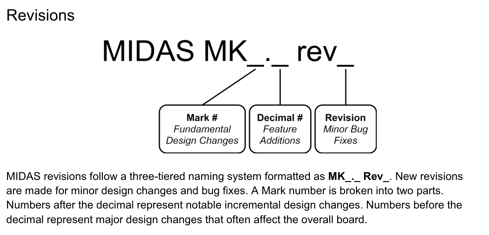

# What is this REPO?

This repo contains all the boards we believe to be stale. 

# How does ISS-PCB naming convention work??

That is a good question. Please see below.

This is defined as part of the [MIDAS 2023-2024 Report](https://uofi.box.com/s/ehres752iaeetvryr3me8g2p3k849buu)

# What makes a project Stale/Archived?

An ENTIRE BOARD (all MARKS and REV underneath it) will be archived under these conditions:

- The project is inactive. This means the board generation is no longer being used with no new revs coming out. 

